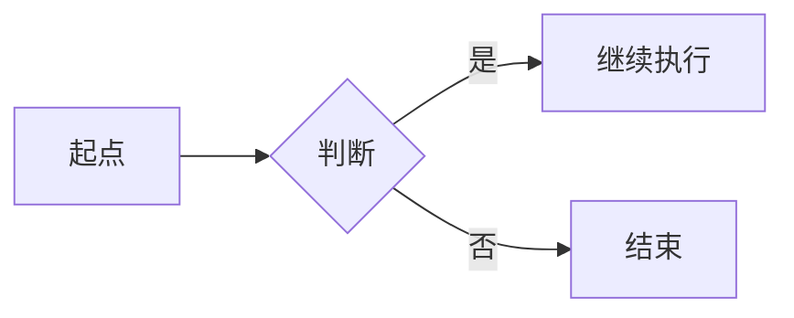

# 测试标题


第一篇 blog，下面是一些 Markdown 元素测试。

---

## 💻 代码块示例

```js
// JavaScript 示例
console.log('Hello, Mermaid + Markdown + 暗色模式！');
```

<pre>

```mermaid
graph LR
A[起点] --> B{判断}
B -- 是 --> C[继续执行]
B -- 否 --> D[结束]
```
</pre>
